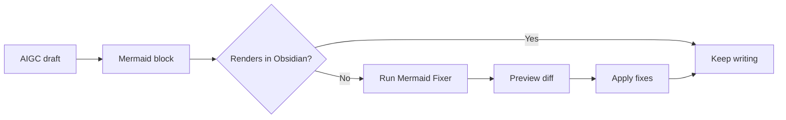
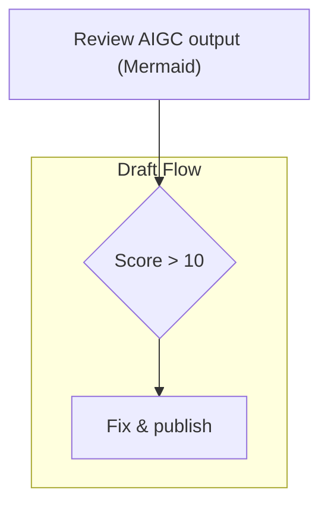

# Mermaid Fixer

Fix common Mermaid syntax errors in Obsidian notes before they break preview, export, or publishing.

Mermaid Fixer is free, local-only, and does not make network requests.

## Why this exists

AIGC tools now generate more Markdown, specs, and diagrams than ever. They are useful, but they still frequently produce Mermaid blocks that look almost right while failing to render in Obsidian.

Mermaid Fixer turns those repeat fixes into a one-command workflow. Run it on the current note or scan the whole vault, preview the diff, and apply the safe fixes you want.



## Highlights

| Capability | Details |
| :--- | :--- |
| Current-file fix | Fix the active note from the command palette. |
| Whole-vault scan | Scan Markdown files across the vault with size and directory filters. |
| Diff preview | Review proposed changes before applying them. |
| Rule toggles | Enable or disable each fix rule independently. |
| Local-first | No accounts, API keys, network requests, telemetry, or hosted service. |
| Free release | No paid features, subscriptions, donations, or external paid services. |

## Fix rules

Mermaid Fixer targets common syntax problems that often appear in AI-generated or hand-edited diagrams:

| Rule | Example problem | Fix |
| :--- | :--- | :--- |
| Sequence multiline messages | Message text accidentally continues on the next indented line. | Collapse the message into one line. |
| State labels with `>` or `+` | Transition labels contain special characters without quotes. | Quote the transition label. |
| Diamond node `>` text | Flowchart decision text contains `>`. | Quote the diamond node text. |
| Parenthesis conflicts | Node text contains brackets that conflict with the node shape. | Quote the node text. |
| Subgraph titles with spaces | Multi-word subgraph titles are unquoted. | Quote the subgraph title. |
| Unquoted ampersands | Node text contains `&` without quotes. | Quote the node text. |

## Example

AI-generated diagrams often fail in a way that looks like this:

````text
```mermaid
graph TD
A[Review AIGC output (Mermaid)] --> B{Score > 10}
subgraph Draft Flow
B --> C[Fix & publish]
end
```
````

Obsidian may show a Mermaid parse error instead of a diagram:

```text
ERROR ON LINE 3:
A[Review AIGC output (Mermaid)] --> B{Score > 10}
-------------------------------------^
Expecting a valid node label, string, or quoted text.
```

Run Mermaid Fixer, preview the diff, apply the fix, and the same block becomes renderable:



## Installation

Mermaid Fixer requires Obsidian 1.1.0 or newer.

### Community plugins

After the plugin is accepted into the Obsidian Community directory:

1. Open Obsidian settings.
2. Go to Community plugins.
3. Search for Mermaid Fixer.
4. Install and enable the plugin.

### Manual install

1. Download the latest GitHub release.
2. Copy `main.js`, `manifest.json`, and `styles.css`.
3. Place them in `.obsidian/plugins/mermaid-fixer/`.
4. Reload Obsidian.
5. Enable Mermaid Fixer in Community plugins.

## Usage

Open the command palette and run:

- `Fix current file`
- `Fix whole vault`

If diff preview is enabled, Mermaid Fixer shows the proposed edits before changing your notes. The current-file command updates the active editor. The whole-vault command scans Markdown files, shows a summary, and applies changes only after confirmation.

## Settings

| Setting | Purpose |
| :--- | :--- |
| Enable sequence multiline fix | Toggle sequence message cleanup. |
| Enable state label fix | Toggle state transition label quoting. |
| Enable diamond node fix | Toggle diamond text quoting. |
| Enable parenthesis conflict fix | Toggle node text quoting for bracket conflicts. |
| Enable subgraph title fix | Toggle multi-word subgraph title quoting. |
| Enable unquoted ampersand fix | Toggle ampersand text quoting. |
| Show diff before applying changes | Preview proposed edits before writing. |
| Max file size | Skip large files during whole-vault scans. |
| Skip directories | Exclude paths such as `node_modules` or generated folders. |

## Privacy

Mermaid Fixer reads note contents only when you run a fix command. It writes only the notes you explicitly choose to update. It does not send vault content off device, does not use telemetry, and does not require an account or API key.

See [PRIVACY.md](PRIVACY.md) for the full data-flow summary.

## Release

See [RELEASE.md](RELEASE.md) for the Community submission checklist and GitHub release artifact rules.

## Development

```bash
npm install
npm test
npm run lint
npm run build
node --check main.js
```

The plugin uses TypeScript, esbuild, and the Obsidian API. Runtime code does not depend on third-party libraries beyond Obsidian itself.

## License

MIT
