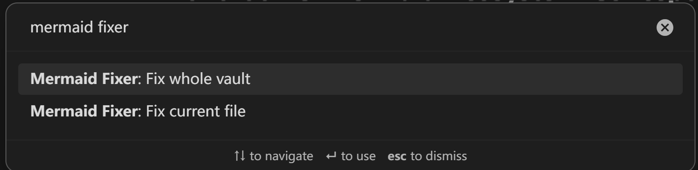
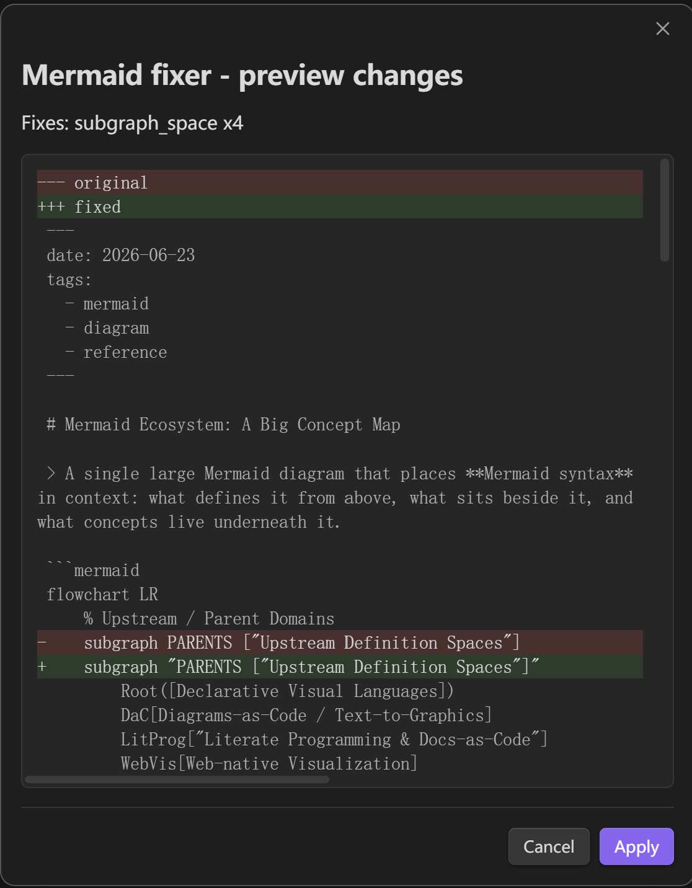

# Mermaid Fixer

Repair Mermaid diagrams and Markdown tables in Obsidian notes before they break preview, export, or publishing.

Mermaid Fixer is free, local-only, and does not make network requests.

## Why this exists

AIGC tools now generate more Markdown, specs, tables, and diagrams than ever. They are useful, but they still frequently produce Mermaid blocks and Markdown tables that look almost right while failing to render in Obsidian.

Mermaid Fixer turns those repeat fixes into a one-command local Markdown repair workflow. Run it on the current note or scan the whole vault, preview the diff, and apply the safe fixes you want.

Open the command palette, choose the current-file or whole-vault repair command, review the diff preview, then apply only when the proposed change looks right.

## Highlights

| Capability | Details |
| :--- | :--- |
| Current-file repair | Repair Mermaid diagrams and Markdown tables in the active note. |
| Whole-vault repair | Scan Markdown files across the vault for Mermaid and table issues. |
| Diff preview | Review proposed changes before applying them. |
| Scan progress | See whole-vault scan progress before the result summary opens. |
| Markdown table repair | Repair common broken Markdown table structures conservatively. |
| Rule toggles | Enable or disable each fix rule independently. |
| Local-first | No accounts, API keys, network requests, telemetry, or hosted service. |
| Free release | No paid features, subscriptions, donations, or external paid services. |

## Usage

Search for **Mermaid Fixer** in the command palette. The plugin provides one command for the active note and one for a vault-wide scan.



When diff preview is enabled, Mermaid Fixer shows the exact edits it wants to make. Nothing is written until you click **Apply**.



When no repair is needed, Mermaid Fixer confirms the clean state with:

```text
All Mermaid and table are good.
```

## Fix rules

Mermaid Fixer targets common syntax problems that often appear in AI-generated or hand-edited diagrams and tables.

### Mermaid rules

| Rule | Example problem | Fix |
| :--- | :--- | :--- |
| Sequence multiline messages | Message text accidentally continues on the next indented line. | Collapse the message into one line. |
| State labels with `>` or `+` | Transition labels contain special characters without quotes. | Quote the transition label. |
| Diamond node `>` text | Flowchart decision text contains `>`. | Quote the diamond node text. |
| Parenthesis conflicts | Node text contains brackets that conflict with the node shape. | Quote the node text. |
| Bare Mermaid documents | A note contains only Mermaid code without a `mermaid` fence. | Wrap the document in a Mermaid code fence. |
| Subgraph title syntax | Multi-word titles, quoted `ID[Title]` shorthand, or compact `ID["Title"]` syntax confuse Mermaid. | Normalize the subgraph title syntax. |
| Unquoted ampersands | Node text contains `&` without quotes. | Quote the node text. |
| Style line comments | `style ... %% comment` is parsed as part of the style statement. | Move the comment onto its own Mermaid comment line. |
| Nested quotes | Labels or subgraph titles contain nested double quotes. | Replace the inner quotes with safe single quotes. |
| C4 keywords in flowcharts | `C4Context` / `C4Container` text can trigger Mermaid's C4 parser by mistake. | Rewrite the internal node keywords to flowchart-safe identifiers. |
| Edge labels with syntax characters | Flowchart edge labels contain `{}`, `[]`, `()`, or `*` without quotes. | Quote the edge label. |

### Markdown table rules

| Rule | Example problem | Fix |
| :--- | :--- | :--- |
| Collapsed one-line tables | Header, separator, and body cells are collapsed onto one physical line. | Split safe sequences into table rows. |
| Separator normalization | Separator cells use `---` or inconsistent alignment markers. | Normalize separators to `:---`. |
| Blank lines inside tables | A blank line breaks a table block. | Remove the blank line when surrounding rows clearly belong together. |
| Missing separator leading pipe | A separator continuation starts without `|`. | Rebuild the table when the column count is clear. |
| Short rows | A row has fewer cells than the header. | Pad safe short rows with empty cells. |

Table repair is conservative. Ambiguous rows are left unchanged, and fenced code blocks are never modified by table repair.

## Examples

### Mermaid diagram repair

Mermaid Fixer is aimed at diagrams that are almost valid: an unquoted subgraph title, a label with conflicting brackets, an inline `style` comment, an API route like `{key}` inside an edge label, or flowchart text that accidentally trips Mermaid's C4 parser. The preview shows the exact before/after diff before the note changes.

### Markdown table repair

AI-generated Markdown tables often fail in a quieter way:

```text
| Plan | Success | Time | :--- | :--- | :--- | A | 95% | 30 min | B | 85% | 15 min |
```

Mermaid Fixer can turn the safe collapsed sequence into a normal Markdown table:

| Plan | Success | Time |
| :--- | :--- | :--- |
| A | 95% | 30 min |
| B | 85% | 15 min |

## Installation

Mermaid Fixer requires Obsidian 1.1.0 or newer.

### Community plugins

After the plugin is accepted into the Obsidian Community directory:

1. Open Obsidian settings.
2. Go to Community plugins.
3. Search for Mermaid Fixer.
4. Install and enable the plugin.

### Manual install

1. Download the latest GitHub release.
2. Copy `main.js`, `manifest.json`, and `styles.css`.
3. Place them in `.obsidian/plugins/mermaid-fixer/`.
4. Reload Obsidian.
5. Enable Mermaid Fixer in Community plugins.

## Settings

| Setting | Purpose |
| :--- | :--- |
| Enable sequence multiline fix | Toggle sequence message cleanup. |
| Enable state label fix | Toggle state transition label quoting. |
| Enable diamond node fix | Toggle diamond text quoting. |
| Enable parenthesis conflict fix | Toggle node text quoting for bracket conflicts. |
| Enable subgraph title fix | Toggle subgraph title normalization. |
| Enable unquoted ampersand fix | Toggle ampersand text quoting. |
| Enable style comment fix | Toggle moving Mermaid `style` line comments onto separate lines. |
| Enable nested quote fix | Toggle nested double-quote cleanup in Mermaid labels and titles. |
| Enable C4 keyword fix | Toggle C4 keyword rewrites that prevent flowchart parser misdetection. |
| Enable edge label special character fix | Toggle quoting for flowchart edge labels with Mermaid-significant characters. |
| Enable Markdown table fixes | Toggle all Markdown table repair rules. |
| Fix collapsed one-line tables | Toggle safe collapsed table splitting. |
| Normalize table separators | Toggle table separator normalization. |
| Remove blank lines inside tables | Toggle safe blank-line cleanup. |
| Pad short table rows | Toggle empty-cell padding for short rows. |
| Show diff before applying changes | Preview proposed edits before writing. |
| Max file size | Skip large files during whole-vault scans. |
| Skip directories | Exclude paths such as `node_modules` or generated folders. |

## Privacy

Mermaid Fixer reads note contents only when you run a repair command. It writes only the notes you explicitly choose to update. Mermaid and table repair both run locally. The plugin does not send vault content off device, does not use telemetry, and does not require an account or API key.

### Vault enumeration

Mermaid Fixer calls `app.vault.getMarkdownFiles()` only when you run the `Fix whole vault` command. This lets the plugin list Markdown file paths in the current vault so it can scan for Mermaid diagrams and Markdown tables that may need repair. During that command, non-skipped Markdown files are read in memory to detect fix candidates. The scan runs locally, does not make network requests, and does not send file paths or note contents off device. Files are modified only after you review and confirm the proposed changes.

See [PRIVACY.md](PRIVACY.md) for the full data-flow summary.

## Release

See [RELEASE.md](RELEASE.md) for the Community submission checklist and GitHub release artifact rules.

## Development

```bash
npm install
npm test
npm run lint
npm run build
node --check main.js
```

The plugin uses TypeScript, esbuild, and the Obsidian API. Runtime code does not depend on third-party libraries beyond Obsidian itself.

## License

MIT
